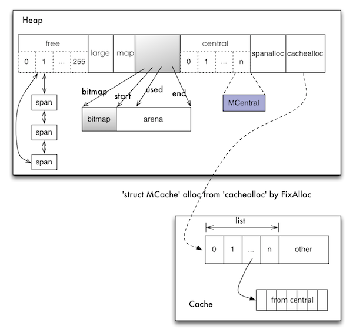

# Go 语言内存分配器的实现

> 本文为转载，原文地址：http://www.bigendian123.com/go/2013/10/13/go-memory-manage-system-alloc/

前几天断断续续的写了 3 篇关于 Go 语言内存分配器的文章，分别是 [Go 语言内存分配器设计](http://www.bigendian123.com/go/2013/10/08/go-memory-manage-system-design/)、[Go 语言内存分配器-FixAlloc](http://www.bigendian123.com/go/2013/10/09/go-memory-manage-system-fixalloc/)、[Go 语言内存分配器-MSpan](http://www.bigendian123.com/go/2013/10/11/go-memory-manage-system-span/)，这 3 篇主要是本文的前戏，其实所有的内容本可以在一篇里写完的，但内容实在太多了，没精力一口气搞定。本文将把整个内存分配器的架构以及核心组件给详细的介绍一下，当然亲自对照着翻看一下代码才是王道。

[more]

内存布局结构图



我把整个核心代码的逻辑给抽象绘制出了这个内存布局图，它基本展示了 Go 语言内存分配器的整体结构以及部分细节（这结构图应该同样适用于 tcmalloc）。从此结构图来看，内存分配器还是有一点小复杂的，但根据具体的逻辑层次可以拆成三个大模块—— cache，central，heap，然后一个一个的模块分析下去，逻辑就显得特别清晰明了了。位于结构图最下边的 `Cache` 就是 cache 模块部分；central 模块对应深蓝色部分的 `MCentral`，central 模块的逻辑结构很简单，所以结构图就没有详细的绘制了；`Heap` 是结构图中的核心结构，对应heap模块，也可以看出来 central 是直接被 Heap 管理起来的，属于 Heap 的子模块。

在分析内存分配器这部分源码的时候，首先需要明确的是所有内存分配的入口，有了入口就可以从这里作为起点一条线的看下去，不会有太大的障碍。这个入口就是 malloc.goc 源文件中的 `runtime·mallocgc` 函数，这个入口函数的主要工作就是分配内存以及触发 gc (本文将只介绍内存分配)，在进入真正的分配内存之前，此入口函数还会判断请求的是小内存分配还是大内存分配( 32k 作为分界线)；小内存分配将调用 `runtime·MCache_Alloc` 函数从 Cache 获取，而大内存分配调用 `runtime·MHeap_Alloc` 直接从 Heap 获取。入口函数过后，就会真正的进入到具体的内存分配过程中去了。

在真正进入内存分配过程之前，还需要了解一下整个内存分配器是如何创建的以及初始化成什么样子。完成内存分配器创建初始化的函数是 `runtime·mallocinit` ，看一下简化的源码：

```
void
runtime·mallocinit(void)
{
	// 创建mheap对象，这个是直接从操作系统分配内存。heap是全局的，所有线程共享，一个Go进程里只有一个heap。
	if((runtime·mheap = runtime·SysAlloc(sizeof(*runtime·mheap))) == nil)
		runtime·throw("runtime: cannot allocate heap metadata");

	// 64位平台，申请一大块内存地址保留区，后续所有page的申请都会从这个地址区里分配。这个区就是结构图中的arena。 
	if(sizeof(void*) == 8 && (limit == 0 || limit > (1<<30))) {
		arena_size = MaxMem;
		bitmap_size = arena_size / (sizeof(void*)*8/4);
		p = runtime·SysReserve((void*)(0x00c0ULL<<32), bitmap_size + arena_size);
	}

	// 初始化好heap的arena以及bitmap。
	runtime·mheap->bitmap = p;
	runtime·mheap->arena_start = p + bitmap_size;
	runtime·mheap->arena_used = runtime·mheap->arena_start;
	runtime·mheap->arena_end = runtime·mheap->arena_start + arena_size;

	// 初始化heap的其他内部结构，如：spanalloc、cacachealloc都FixAlloc的初始化，free、large字段都是挂载维护span的双向循环链表。
	runtime·MHeap_Init(runtime·mheap, runtime·SysAlloc);
	
	// 从heap的cachealloc从分配MCache，挂在一个线程上。
	m->mcache = runtime·allocmcache();
}
```

初始化过程主要是在折腾 mcache 和 mheap 两个部分，而 mcentral 在实际逻辑中是属于 mheap 的子模块，所以初始化过程就没明确的体现出来，这和我绘制的结构图由两大块构造相对应。**heap 是所有底层线程共享的；而 cache 是每个线程都分别拥有一个，是独享的。在 64 位平台，heap 从操作系统申请的内存地址保留区只有 136G，其中 bitmap 需要 8G 空间，因此真正可申请的内存就是 128G。当然 128G 在绝大多数情况都是够用的，但我所知道的还是有个别特殊应用的单机内存是超过 128G 的。**

下面按小内存分配的处理路径，从 cache 到 central 到 heap 的过程详细介绍一下。

## Cache

cache 的实现主要在 mcache.c 源文件中，结构 MCache 定义在 malloc.h 中，从 cache 中申请内存的函数原型:

	void *runtime·MCache_Alloc(MCache *c, int32 sizeclass, uintptr size, int32 zeroed)
	
参数 `size` 是需要申请的内存大小，需要知道的是这个 size 并不一定是我们申请内存的时候指定的大小，一般来说它会稍大于指定的大小。从结构图上可以清晰看到 cache 有一个 0 到 n 的 list 数组，list 数组的每个单元挂载的是一个链表，链表的每个节点就是一块可用的内存，同一链表中的所有节点内存块都是大小相等的；但是不同链表的内存大小是不等的，也就是说 list 数组的一个单元存储的是一类固定大小的内存块，不同单元里存储的内存块大小是不等的。这就说明 cache 缓存的是不同类大小的内存对象，当然想申请的内存大小最接近于哪类缓存内存块时，就分配哪类内存块。list 数组的 0 到 n 下标就是不同的 sizeclass，n 是一个固定值等于 60，所以 cache 能够提供 60 类(0<sizeclass<61)不同大小的内存块。这 60 类大小是如何划分的，可以查看 msize.c 源文件。

runtime·MCache_Alloc 分配内存的过程是，根据参数 sizeclass从list 数组中取出一个内存块链表，如果这个链表不为空，就直接把第一个节点返回即可；如果链表是空，说明 cache 中没有满足此类大小的缓存内存，这个时候就调用 `runtime·MCentral_AllocList` 从 central 中获取 **一批** 此类大小的内存块，再把第一个节点返回使用，其他剩余的内存块挂到这个链表上，为下一次分配做好缓存。

cache 上的内存分配逻辑很简单，就是 cache 取不到就到 central 中去取。除了内存的分配外，cache 上还存在很多的状态计数器，主要是用来统计内存的分配情况，比如：分配了多少内存，缓存了多少内存等等。这些状态计数器非常重要，可以用来监控我们程序的内存管理情况以及 profile 等，runtime 包里的 `MemStats` 类的数据就是来自这些底层的计数器。

cache 的释放条件主要有两个，一是当某个内存块链表过长（>=256）时，就会截取此链表的一部分节点，返还给 central；二是整个 cache 缓存的内存过大(>=1M)，同样将每个链表返还一部分节点给 central。

**cache 层在进行内存分配和释放操作的时候，是没有进行加锁的，也不需要加锁，因为 cache 是每个线程独享的。所以 cache 层的主要目的就是提高小内存的频繁分配释放速度。**

## Central

malloc.h 源文件里 MHeap 结构关于 central 的定义如下：

```
struct MHeap
{
	。。。
	
	struct {
		MCentral;
		byte pad[CacheLineSize];
	} central[NumSizeClasses];
	
	。。。
}
```

结合结构图可以看出，在 heap 结构里，使用了一个 0 到 n 的数组来存储了一批 central，并不是只有一个 central 对象。从上面结构定义可以知道这个数组长度位 61 个元素，也就是说 heap 里其实是维护了 61 个 central，这 61 个 central 对应了 cache 中的 list 数组，也就是每一个 sizeclass 就有一个 central。所以，在 cache 中申请内存时，如果在某个 sizeclass 的内存链表上找不到空闲内存，那么 cache 就会向对应的 sizeclass 的 central 获取一批内存块。注意，这里 central 数组的定义里面使用填充字节，这是因为多线程会并发访问不同 central 避免 false sharing。

central 的实现主要在 mcentral.c 源文件，核心结构 MCentral 定义在 malloc.h 中，结构如下：

```
struct MCentral
{
	Lock;
	int32 sizeclass;
	MSpan nonempty;
	MSpan empty;
	int32 nfree;
};
```

MCentral 结构中的 nonempty 和 empty 字段是比较重要的，重点解释一下这两个字段。这两字段都是 MSpan 类型，大胆的猜测一下这两个字段将分别挂一个 span 节点构造的双向链表（MSpan 在上一篇文章详细介绍了），只是这个双向链表的头节点不作使用罢了。`nonempty` 字面意思是非空，表示这个链表上存储的 span 节点都是非空状态，也就是说这些 span 节点都有空闲的内存；`empty` 表示此链表存储的 span 都是空的，它们都没有空闲可用的内存了。其实一开始 empty 链表就是空的，是当 nonempty 上的的一个 span 节点被用完后，就会将 span 移到 empty 链表中。

我们知道 cache 在内存不足的时候，会通过 `runtime·MCentral_AllocList从central` 获取一批内存块，central 其实也只有 cache 一个上游用户，看一下此函数的简化逻辑：

```
int32
runtime·MCentral_AllocList(MCentral *c, int32 n, MLink **pfirst)
{
	runtime·lock(c);

	// 第一部分：判断nonempty是否为空，如果是空的话，就需要从heap中获取span来填充nonempty链表了。		
	// Replenish central list if empty.
	if(runtime·MSpanList_IsEmpty(&c->nonempty)) {
		if(!MCentral_Grow(c)) {
			。。。。。。。
		}
	}

	// 第二部分：从nonempty链表上取一个span节点，然后从span的freelist里获取足够的内存块。这个span内存不足时，就有多少拿多少了。
	s = c->nonempty.next;
	cap = (s->npages << PageShift) / s->elemsize;
	avail = cap - s->ref;
	if(avail < n)
		n = avail;

	// First one is guaranteed to work, because we just grew the list.
	first = s->freelist;
	last = first;
	for(i=1; i<n; i++) {
		last = last->next;
	}
	s->freelist = last->next;
	last->next = nil;
	s->ref += n;
	c->nfree -= n;

	// 第三部分：如果上面的span内存被取完了，就将它移到empty链表中去。
	if(n == avail) {
		runtime·MSpanList_Remove(s);
		runtime·MSpanList_Insert(&c->empty, s);
	}

	runtime·unlock(c);
	
	// 第四部分：最后将取得的内存块链通过参数pfirst返回。
	*pfirst = first;
	return n;
}
```

从 central 中获取一批内存块交给 cache 的过程，看上去也不怎么复杂，只是这个过程是需要加锁的。这里重点要关注第一部分填充 nonempty 的情况，也就是 central 没有空闲内存，需要向 heap 申请。这里调用的是 `MCentral_Grow` 函数。MCentral_Grow 函数的主要工作是，首先调用 runtime·MHeap_Alloc 函数向 heap 申请一个 span；然后将 span 里的连续 page 给切分成 central 对应的 sizeclass 的小内存块，并将这些小内存串成链表挂在 span 的 freelist 上；最后将 span 放入到 nonempty 链表中。**central 在无空闲内存的时候，向 heap 只要了一个 span，不是多个；申请的 span 含多少 page 是根据 central 对应的 sizeclass 来确定。**

central 中的内存分配过程搞定了，看一下大概的释放过程。cache 层在释放内存的时候，是将一批小内存块返还给 central，central 在收到这些归还的内存块的时候，会把每个内存块分别还给对应的 span。在把内存块还给 span 后，如果 span 先前是被用完了内存，待在 empty 链表中，那么此刻就需要将它移动到 nonempty 中，表示又有可用内存了。在归还小内存块给 span 后，如果 span 中的所有 page 内存都收回来了，也就是没有任何内存被使用了，此刻就会将这个 span 整体归还给 heap 了。

在 central 这一层，内存的管理粒度基本就是 span 了，所以 span 是非常重要的一个工具组件。

### Heap

总算来到了最大的一层 heap，这是离 Go 程序最远的一层，离操作系统最近的一层，这一层主要就是从操作系统申请内存交给 central 等。heap 的核心结构 MHeap 定义在 malloc.h 中，一定要细看。不管是通过 central 从 heap 获取内存，还是大内存情况跳过了 cache 和 central 直接向 heap 要内存，都是调用如下函数来请求内存的。

	MSpan* runtime·MHeap_Alloc(MHeap *h, uintptr npage, int32 sizeclass, int32 acct, int32 zeroed)

函数原型可以看出，向 heap 要内存，不是以字节为单位，而是要多少个 page。参数 npage 就是需要的 page 数量，sizeclass 等于 0，就是绕过 cache 和 central 的直接找 heap 的大内存分配；central 调用此函数时，sizecalss 一定是 1 到 60 的一个值。从 heap 中申请到的所有 page 肯定都是连续的，并且是通过 span 来管理的，所以返回值是一个 span，不是 page 数组等。

真正在 heap 中执行内存分配逻辑的是位于 mheap.c 中的 `MHeap_AllocLocked` 函数。分析此函数的逻辑前，先看一下结构图中 heap 的 free 和 large 两个域。free 是一个 256 个单元的数组，每个单元上存储的都是一个 span 链表；但是不同的单元 span 含 page 的个数也是不同的，span 含 page 的个数等于此 span 所在单元的下标，比如：free[5] 中的 span 都含有 5 个 page。如果一个 span 的 page 数超过了 255，那这个 span 就会被放到 `large` 链表中。

从 heap 中要内存，首先是根据请求的 page 数量到 free 或者 large 中获取一个最合适的 span。当然，如果在 large 链表中都找不到合适的 span，就只能调用 MHeap_Grow 函数从操作系统申请内存，然后填充 Heap，再试图分配。拿到的 span 所含 page 数大于了请求的 page 数的的时候，并不会将整个 span 返回使用，而是对这个 span 进行拆分，拆为两个 span，将剩余 span 重新放回到 free 或者 large 链表中去。因为 heap 面对的始终是 page，如果全部返回使用，可能就会太浪费内存了，所以这里只返回请求的 page 数是有必要的。

从 heap 中请求出去的 span，在遇到内存释放退还给 heap 的时候，主要也是将 span 放入到 free 或者 large 链表中。

heap 比骄复杂的不是分配释放内存，而是需要维护很多的元数据，比如结构图还没有介绍的 map 域，这个 map 维护的就是 page 到 span 的映射，也就是任何一块内存在算出 page 后，就可以知道这块内存属于哪个 span 了，这样才能做到正确的内存回收。除了 map 以外，还有 bitmap 等结构，用来标记内存，为 gc 服务。

后面对垃圾收集器(gc)的分析时，还会回头来看 heap。本文内容已经够多了，但确实还有很多的细节没有介绍到，比如：heap 是如何从操作系统拿内存、heap 中存在一个 2 分钟定时强制 gc 的 goroutine 等等。

强烈建议熟悉 C 语言的，亲自看看源码，里面有太多有趣的细节了。

注意：本文基于 Go1.1.2 版本代码。