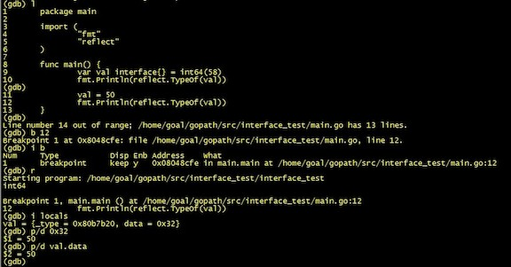
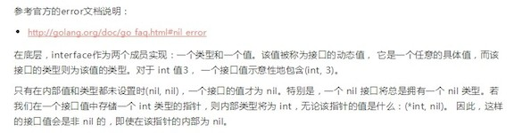

# golang: 详解 interface 和 nil

> 本文为转载，原文地址：http://my.oschina.net/goal/blog/194233

golang的nil在概念上和其它语言的null、None、nil、NULL一样，都指代零值或空值。nil是预先说明的标识符，也即通常意义上的关键字。在golang中，nil只能赋值给指针、channel、func、interface、map或slice类型的变量。如果未遵循这个规则，则会引发panic。对此官方有明确的说明：http://pkg.golang.org/pkg/builtin/#Type

[more]


golang中的interface类似于java的interface、PHP的interface或C++的纯虚基类。接口就是一个协议，规定了一组成员。这个没什么好说的，本文不打算对宏观上的接口概念和基于接口的范式编程做剖析。golang语言的接口有其独到之处：只要类型T的公开方法完全满足接口I的要求，就可以把类型T的对象用在需要接口I的地方。这种做法的学名叫做 [Structural Typing](http://en.wikipedia.org/wiki/Structural_type_system)，有人也把它看作是一种静态的Duck Typing。所谓类型T的公开方法完全满足接口I的要求，也即是类型T实现了接口I所规定的一组成员。

在底层，interface作为两个成员来实现，一个类型和一个值。对此官方也有文档说明：http://golang.org/doc/go_faq.html#nil_error，如果您不习惯看英文，这里有一篇柴大的翻译：[Go 中 error 类型的 nil 值和 nil](http://my.oschina.net/chai2010/blog/117923) 。

接下来通过编写测试代码和gdb来看看interface倒底是什么。会用到反射，如果您不太了解golang的反射是什么，这里有刑星翻译自官方博客的一篇文章：[反射的规则](http://mikespook.com/2011/09/%E5%8F%8D%E5%B0%84%E7%9A%84%E8%A7%84%E5%88%99/)，原文在：[laws-of-reflection](http://blog.golang.org/laws-of-reflection)。

$GOPATH/src

----interface_test

--------main.go

main.go的代码如下：

```
package main

import (
	"fmt"
	"reflect"
)

func main() {
	var val interface{} = int64(58)
	fmt.Println(reflect.TypeOf(val))
	val = 50
	fmt.Println(reflect.TypeOf(val))
}
```

我们已经知道接口类型的变量底层是作为两个成员来实现，一个是type，一个是data。type用于存储变量的动态类型，data用于存储变量的具体数据。在上面的例子中，第一条打印语句输出的是：int64。这是因为已经显示的将类型为int64的数据58赋值给了interface类型的变量val，所以val的底层结构应该是：(int64, 58)。我们暂且用这种二元组的方式来描述，二元组的第一个成员为type，第二个成员为data。第二条打印语句输出的是：int。这是因为字面量的整数在golang中默认的类型是int，所以这个时候val的底层结构就变成了：(int, 50)。借助于gdb很容易观察到这点：

```
$ cd $GOPATH/src/interface_test
$ go build -gcflags "-N -l"
$ gdb interface_test
```



接下来说说interface类型的值和nil的比较问题。这是个比较经典的问题，也算是golang的一个坑。



翻译

接着来看代码：

```
package main

import (
	"fmt"
)

func main() {
	var val interface{} = nil
	if val == nil {
		fmt.Println("val is nil")
	} else {
		fmt.Println("val is not nil")
	}
}
```

变量val是interface类型，它的底层结构必然是(type, data)。由于nil是untyped(无类型)，而又将nil赋值给了变量val，所以val实际上存储的是(nil, nil)。因此很容易就知道val和nil的相等比较是为true的。

```
$ cd $GOPATH/src/interface_test
$ go build
$ ./interface_test
val is nil
```

对于将任何其它有意义的值类型赋值给val，都导致val持有一个有效的类型和数据。也就是说变量val的底层结构肯定不为(nil, nil)，因此它和nil的相等比较总是为false。

上面的讨论都是在围绕值类型来进行的。在继续讨论之前，让我们来看一种特例：(*interface{})(nil)。将nil转成interface类型的指针，其实得到的结果仅仅是空接口类型指针并且它指向无效的地址。注意是空接口类型指针而不是空指针，这两者的区别蛮大的，学过C的童鞋都知道空指针是什么概念。

关于(*interface{})(nil)还有一些要注意的地方。这里仅仅是拿(*interface{})(nil)来举例，对于(*int)(nil)、(*byte)(nil)等等来说是一样的。上面的代码定义了接口指针类型变量val，它指向无效的地址(0x0)，因此val持有无效的数据。但它是有类型的(*interface{})。所以val的底层结构应该是：(*interface{}, nil)。有时候您会看到(*interface{})(nil)的应用，比如var ptrIface = (*interface{})(nil)，如果您接下来将ptrIface指向其它类型的指针，将通不过编译。或者您这样赋值：*ptrIface = 123，那样的话编译是通过了，但在运行时还是会panic的，这是因为ptrIface指向的是无效的内存地址。其实声明类似ptrIface这样的变量，是因为使用者只是关心指针的类型，而忽略它存储的值是什么。还是以例子来说明：

```
package main

import (
	"fmt"
)

func main() {
	var val interface{} = (*interface{})(nil)
	// val = (*int)(nil)
	if val == nil {
		fmt.Println("val is nil")
	} else {
		fmt.Println("val is not nil")
	}
}
```

很显然，无论该指针的值是什么：(*interface{}, nil)，这样的接口值总是非nil的，即使在该指针的内部为nil。

```
$ cd $GOPATH/src/interface_test
$ go build
$ ./interface_test
val is not nil
```

interface类型的变量和nil的相等比较出现最多的地方应该是error接口类型的值与nil的比较。有时候您想自定义一个返回错误的函数来做这个事，可能会写出以下代码：
 
```
package main

import (
	"fmt"
)

type data struct{}

func (this *data) Error() string { return "" }

func test() error {
	var p *data = nil
	return p
}

func main() {
	var e error = test()
	if e == nil {
		fmt.Println("e is nil")
	} else {
		fmt.Println("e is not nil")
	}
}
```

但是很可惜，以上代码是有问题的。

```
$ cd $GOPATH/src/interface_test
$ go build
$ ./interface_test
e is not nil
```

我们可以来分析一下。error是一个接口类型，test方法中返回的指针p虽然数据是nil，但是由于它被返回成包装的error类型，也即它是有类型的。所以它的底层结构应该是(*data, nil)，很明显它是非nil的。

可以打印观察下底层结构数据：

```
package main

import (
	"fmt"
	"unsafe"
)

type data struct{}

func (this *data) Error() string { return "" }

func test() error {
	var p *data = nil
	return p
}

func main() {
	var e error = test()

	d := (*struct {
		itab uintptr
		data uintptr
	})(unsafe.Pointer(&e))

	fmt.Println(d)
}
```

```
$ cd $GOPATH/src/interface_test
$ go build
$ ./interface_test
&{3078907912 0}
```

正确的做法应该是：

```
package main

import (
	"fmt"
)

type data struct{}

func (this *data) Error() string { return "" }

func bad() bool {
	return true
}

func test() error {
	var p *data = nil
	if bad() {
		return p
	}
	return nil
}

func main() {
	var e error = test()
	if e == nil {
		fmt.Println("e is nil")
	} else {
		fmt.Println("e is not nil")
	}
}
```