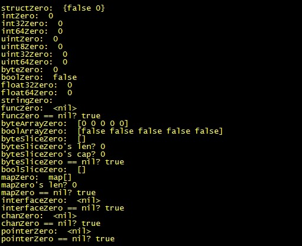
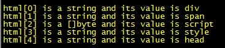

# golang: 类型转换和类型断言

> 本文为转载，原文地址：http://my.oschina.net/goal/blog/194308

类型转换在程序设计中都是不可避免的问题。当然有一些语言将这个过程给模糊了，大多数时候开发者并不需要去关注这方面的问题。但是golang中的类型匹配是很严格的，不同的类型之间通常需要手动转换，编译器不会代你去做这个事。我之所以说通常需要手动转换，是因为interface类型作为一个特例，会有不同的处理方式。

golang中的所有类型都有自己的默认值，对此我做了个测试。

[more]

$GOPATH/src

----typeassert_test

--------main.go

main.go的代码如下：

```
package main

import (
	"fmt"
)

type myStruct struct {
	name   bool
	userid int64
}

var structZero myStruct
var intZero int
var int32Zero int32
var int64Zero int64
var uintZero uint
var uint8Zero uint8
var uint32Zero uint32
var uint64Zero uint64
var byteZero byte
var boolZero bool
var float32Zero float32
var float64Zero float64
var stringZero string
var funcZero func(int) int
var byteArrayZero [5]byte
var boolArrayZero [5]bool
var byteSliceZero []byte
var boolSliceZero []bool
var mapZero map[string]bool
var interfaceZero interface{}
var chanZero chan int
var pointerZero *int

func main() {
	fmt.Println("structZero: ", structZero)
	fmt.Println("intZero: ", intZero)
	fmt.Println("int32Zero: ", int32Zero)
	fmt.Println("int64Zero: ", int64Zero)
	fmt.Println("uintZero: ", uintZero)
	fmt.Println("uint8Zero: ", uint8Zero)
	fmt.Println("uint32Zero: ", uint32Zero)
	fmt.Println("uint64Zero: ", uint64Zero)
	fmt.Println("byteZero: ", byteZero)
	fmt.Println("boolZero: ", boolZero)
	fmt.Println("float32Zero: ", float32Zero)
	fmt.Println("float64Zero: ", float64Zero)
	fmt.Println("stringZero: ", stringZero)
	fmt.Println("funcZero: ", funcZero)
	fmt.Println("funcZero == nil?", funcZero == nil)
	fmt.Println("byteArrayZero: ", byteArrayZero)
	fmt.Println("boolArrayZero: ", boolArrayZero)
	fmt.Println("byteSliceZero: ", byteSliceZero)
	fmt.Println("byteSliceZero's len?", len(byteSliceZero))
	fmt.Println("byteSliceZero's cap?", cap(byteSliceZero))
	fmt.Println("byteSliceZero == nil?", byteSliceZero == nil)
	fmt.Println("boolSliceZero: ", boolSliceZero)
	fmt.Println("mapZero: ", mapZero)
	fmt.Println("mapZero's len?", len(mapZero))
	fmt.Println("mapZero == nil?", mapZero == nil)
	fmt.Println("interfaceZero: ", interfaceZero)
	fmt.Println("interfaceZero == nil?", interfaceZero == nil)
	fmt.Println("chanZero: ", chanZero)
	fmt.Println("chanZero == nil?", chanZero == nil)
	fmt.Println("pointerZero: ", pointerZero)
	fmt.Println("pointerZero == nil?", pointerZero == nil)
}
```

```
$ cd $GOPATH/src/typeassert_test
$ go build
$ ./typeassert_test
```



您可以清楚的了解到各种类型的默认值。如bool的默认值是false，string的默认值是空串，byte的默认值是0，数组的默认就是这个数组成员类型的默认值所组成的数组等等。然而您或许会发现在上面的例子中：map、interface、pointer、slice、func、chan的默认值和nil是相等的。关于nil可以和什么样的类型做相等比较，您只需要知道nil可以赋值给哪些类型变量，那么就可以和哪些类型变量做相等比较。官方对此有明确的说明：http://pkg.golang.org/pkg/builtin/#Type，也可以看我的另一篇文章：[golang: 详解interface和nil](http://my.oschina.net/goal/blog/194233)。所以现在您应该知道nil只能赋值给指针、channel、func、interface、map或slice类型的变量。如果您用int类型的变量跟nil做相等比较，panic会找上您。

对于字面量的值，编译器会有一个隐式转换。看下面的例子：

```
package main

import (
	"fmt"
)

func main() {
	var myInt int32     = 5
	var myFloat float64 = 0
	fmt.Println(myInt)
	fmt.Println(myFloat)
}
```

对于myInt变量，它存储的就是int32类型的5；对于myFloat变量，它存储的是int64类型的0。或许您可能会写出这样的代码，但确实不是必须这么做的：

```
package main

import (
	"fmt"
)

func main() {
	var myInt int32     = int32(5)
	var myFloat float64 = float64(0)
	fmt.Println(myInt)
	fmt.Println(myFloat)
}
```

在C中，大多数类型转换都是可以隐式进行的，比如：

```
#include <stdio.h>

int main(int argc, char **argv)
{
        int uid  = 12345;
        long gid = uid;
        printf("uid=%d, gid=%d\n", uid, gid);
        return 0;
}
```

但是在golang中，您不能这么做。有个类似的例子：

```
package main

import (
	"fmt"
)

func main() {
	var uid int32 = 12345
	var gid int64 = int64(uid)
	fmt.Printf("uid=%d, gid=%d\n", uid, gid)
}
```

很显然，将uid赋值给gid之前，需要将uid强制转换成int64类型，否则会panic。golang中的类型区分静态类型和底层类型。您可以用type关键字定义自己的类型，这样做的好处是可以语义化自己的代码，方便理解和阅读。

```
package main

import (
	"fmt"
)

type MyInt32 int32

func main() {
	var uid int32   = 12345
	var gid MyInt32 = MyInt32(uid)
	fmt.Printf("uid=%d, gid=%d\n", uid, gid)
}
```

在上面的代码中，定义了一个新的类型MyInt32。对于类型MyInt32来说，MyInt32是它的静态类型，int32是它的底层类型。即使两个类型的底层类型相同，在相互赋值时还是需要强制类型转换的。可以用reflect包中的Kind方法来获取相应类型的底层类型。

对于类型转换的截断问题，为了问题的简单化，这里只考虑具有相同底层类型之间的类型转换。小类型(这里指存储空间)向大类型转换时，通常都是安全的。下面是一个大类型向小类型转换的示例：

```
package main

import (
	"fmt"
)

func main() {
	var gid int32 = 0x12345678
	var uid int8  = int8(gid)
	fmt.Printf("uid=0x%02x, gid=0x%02x\n", uid, gid)
}
```

在上面的代码中，gid为int32类型，也即占4个字节空间(在内存中占有4个存储单元)，因此这4个存储单元的值分别是：0x12, 0x34, 0x56, 0x78。但事实不总是如此，这跟cpu架构有关。在内存中的存储方式分为两种：大端序和小端序。大端序的存储方式是高位字节存储在低地址上；小端序的存储方式是高位字节存储在高地址上。本人的机器是按小端序来存储的，所以gid在我的内存上的存储序列是这样的：0x78, 0x56, 0x34, 0x12。如果您的机器是按大端序来存储，则gid的存储序列刚好反过来：0x12, 0x34, 0x56, 0x78。对于强制转换后的uid，肯定是产生了截断行为。因为uid只占1个字节，转换后的结果必然会丢弃掉多余的3个字节。截断的规则是：保留低地址上的数据，丢弃多余的高地址上的数据。来看下测试结果：

```
$ cd $GOPATH/src/typeassert_test
$ go build
$ ./typeassert_test
uid=0x78, gid=0x12345678
```

如果您的输出结果是：

	uid=0x12, gid=0x12345678

那么请不要惊讶，因为您的机器是属于大端序存储。

其实很容易根据上面所说的知识来判断是属于大端序或小端序：

```
package main

import (
	"fmt"
)

func IsBigEndian() bool {
	var i int32 = 0x12345678
	var b byte  = byte(i)
	if b == 0x12 {
		return true
	}

	return false
}

func main() {
	if IsBigEndian() {
		fmt.Println("大端序")
	} else {
		fmt.Println("小端序")
	}
}
```

接口的转换遵循以下规则：

普通类型向接口类型的转换是隐式的。

接口类型向普通类型转换需要类型断言。

普通类型向接口类型转换的例子随处可见，例如：

```
package main

import (
	"fmt"
)

func main() {
	var val interface{} = "hello"
	fmt.Println(val)
	val = []byte{'a', 'b', 'c'}
	fmt.Println(val)
}
```

正如您所预料的，"hello"作为string类型存储在interface{}类型的变量val中，[]byte{'a', 'b', 'c'}作为slice存储在interface{}类型的变量val中。这个过程是隐式的，是编译期确定的。

接口类型向普通类型转换有两种方式：Comma-ok断言和switch测试。任何实现了接口I的类型都可以赋值给这个接口类型变量。由于interface{}包含了0个方法，所以任何类型都实现了interface{}接口，这就是为什么可以将任意类型值赋值给interface{}类型的变量，包括nil。还有一个要注意的就是接口的实现问题，*T包含了定义在T和*T上的所有方法，而T只包含定义在T上的方法。我们来看一个例子：

```
package main

import (
	"fmt"
)

// 演讲者接口
type Speaker interface {
	// 说
	Say(string)
	// 听
	Listen(string) string
	// 打断、插嘴
	Interrupt(string)
}

// 王兰讲师
type WangLan struct {
	msg string
}

func (this *WangLan) Say(msg string) {
	fmt.Printf("王兰说：%s\n", msg)
}

func (this *WangLan) Listen(msg string) string {
	this.msg = msg
	return msg
}

func (this *WangLan) Interrupt(msg string) {
	this.Say(msg)
}

// 江娄讲师
type JiangLou struct {
	msg string
}

func (this *JiangLou) Say(msg string) {
	fmt.Printf("江娄说：%s\n", msg)
}

func (this *JiangLou) Listen(msg string) string {
	this.msg = msg
	return msg
}

func (this *JiangLou) Interrupt(msg string) {
	this.Say(msg)
}

func main() {
	wl := &WangLan{}
	jl := &JiangLou{}

	var person Speaker
	person = wl
	person.Say("Hello World!")
	person = jl
	person.Say("Good Luck!")
}
```

Speaker接口有两个实现WangLan类型和JiangLou类型。但是具体到实例来说，变量wl和变量jl只有是对应实例的指针类型才真正能被Speaker接口变量所持有。这是因为WangLan类型和JiangLou类型所有对Speaker接口的实现都是在*T上。这就是上例中person能够持有wl和jl的原因。

想象一下java的泛型(很可惜golang不支持泛型)，java在支持泛型之前需要手动装箱和拆箱。由于golang能将不同的类型存入到接口类型的变量中，使得问题变得更加复杂。所以有时候我们不得不面临这样一个问题：我们究竟往接口存入的是什么样的类型？有没有办法反向查询？答案是肯定的。

Comma-ok断言的语法是：value, ok := element.(T)。element必须是接口类型的变量，T是普通类型。如果断言失败，ok为false，否则ok为true并且value为变量的值。来看个例子：

```
package main

import (
	"fmt"
)

type Html []interface{}

func main() {
	html := make(Html, 5)
	html[0] = "div"
	html[1] = "span"
	html[2] = []byte("script")
	html[3] = "style"
	html[4] = "head"
	for index, element := range html {
		if value, ok := element.(string); ok {
			fmt.Printf("html[%d] is a string and its value is %s\n", index, value)
		} else if value, ok := element.([]byte); ok {
			fmt.Printf("html[%d] is a []byte and its value is %s\n", index, string(value))
		}
	}
}
```

其实Comma-ok断言还支持另一种简化使用的方式：value := element.(T)。但这种方式不建议使用，因为一旦element.(T)断言失败，则会产生运行时错误。如：

```
package main

import (
	"fmt"
)

func main() {
	var val interface{} = "good"
	fmt.Println(val.(string))
	// fmt.Println(val.(int))
}
```

以上的代码中被注释的那一行会运行时错误。这是因为val实际存储的是string类型，因此断言失败。

还有一种转换方式是switch测试。既然称之为switch测试，也就是说这种转换方式只能出现在switch语句中。可以很轻松的将刚才用Comma-ok断言的例子换成由switch测试来实现：

```
package main

import (
	"fmt"
)

type Html []interface{}

func main() {
	html := make(Html, 5)
	html[0] = "div"
	html[1] = "span"
	html[2] = []byte("script")
	html[3] = "style"
	html[4] = "head"
	for index, element := range html {
		switch value := element.(type) {
		case string:
			fmt.Printf("html[%d] is a string and its value is %s\n", index, value)
		case []byte:
			fmt.Printf("html[%d] is a []byte and its value is %s\n", index, string(value))
		case int:
			fmt.Printf("error type\n")
		default:
			fmt.Printf("unknown type\n")
		}
	}
}
```

```
$ cd $GOPATH/src/typeassert_test
$ go build
$ ./typeassert_test
```

