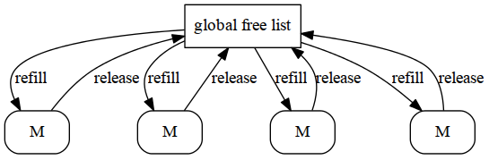
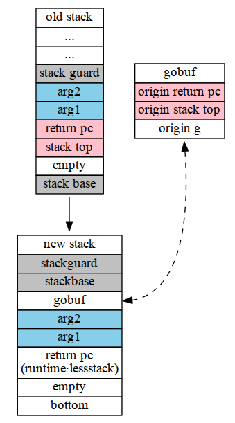

# Read Go - Split Stack

> 本文为转载，原文地址：http://totorow.herokuapp.com/posts/Read_Go_-_Split_Stack

如果大家对split stack还不是很清楚, 这里有一篇[介绍文档](http://gcc.gnu.org/wiki/SplitStacks). 关于split stack有许多实现方案,这里主要看下go中是如果实现的.

## Strategy

一般来说,在每次函数调用之前,都应该检查当前的堆栈指针(SP)是否已经达到或者超过限制的大小(g->stackguard), 如果没有,则仍然在当前的stack上完成函数调用, 反之,则需要重新申请一个新的stack,并在新的stack上完成函数调用, 同时,当函数完成调用之后需要将申请的stack释放掉(这里的新的stack是在heap上申请的).

[more]

上述就是大致的流程,不过,试想如果有很多函数调用, 且这些函数的function frame size很小,这样必然会有很多heap的malloc/free, 所以,对于这些function frame size很小的函数, 会在原有的限制大小上再容忍一定的大小,这个大小就是StackSmall, 那么多大的function frame才算是小呢？同样也有个标准,即StackBig, 在运行时,会根据不同大小的function frame判断是否需要申请新的stack:

- frame size <= StackSmall:

		if SP <= g->stackguard
		    申请新的stack, 并在其上完成函数调用
		else
		    继续在当前的stack上完成函数调用
- StackSmall < frame size < StackBig:

		if SP+(frame size - StackSmall) <= g->stackguard
		    申请新的stack, 并在其上完成函数调用
		else
		    继续在当前的stack上完成函数调用
- frame size >= StackBig:

		申请新的stack, 并在其上完成函数调用
		
## Prepare

我们知道stack就是函数的运行环境(上下文), 而现在需要在新的stack上继续函数调用, 这就带来一个问题,在函数返回时,如何回到之前的上下文环境, 如果你看过kernel中关于进程切换的代码,那就不难回答这个问题. 这里需要保存当前上下文环境:

```
TEXT runtime·morestack(SB),7,$0
...
MOVQ    8(SP), AX   // f's caller's PC
MOVQ    AX, (m_morebuf+gobuf_pc)(BX)
LEAQ    16(SP), AX  // f's caller's SP
MOVQ    AX, (m_morebuf+gobuf_sp)(BX)
MOVQ    AX, m_moreargp(BX)
get_tls(CX)
MOVQ    g(CX), SI
MOVQ    SI, (m_morebuf+gobuf_g)(BX)
...
```

可以看出保存的信息包括PC,SP,g,而这些信息都存放在m->morebuf中,

```
struct  M
{
    ...
    Gobuf   morebuf;    // gobuf arg to morestack
    ...
};
struct  Gobuf
{
    uintptr sp;
    byte*   pc;
    G*  g;
};
```

除了保存之前的上下文信息,当前的函数调用信息也被保存下来, 包括pc,arguments,argument size, frame size,分别对应struct M中的如下字段:

```
struct  M
{
    ...
    void    (*morepc)(void);
    void*   moreargp;   // argument pointer for more stack
    uint32  moreargsize;
    uint32  moreframesize;  // size arguments to morestack
    ...
};
```

## Allocation

保存好当前的上下文信息,下面就是申请新的stack,这里有2点需要注意下:

1. 当前所在的stack比较特殊,是schedule goroutine的自己的stack, 也就是说,无论之前用的是哪个stack,都会先切换到schedule goroutine的stack, 然后才进行新的stack的申请.
2. 新的stack是在heap上申请的,同时这些空间不受GC的管理:

```
void*
runtime·stackalloc(uint32 n)
{
    ...
    return runtime·mallocgc(n, FlagNoProfiling|FlagNoGC, 0, 0);
}
```

这里有个corner case需要考虑: 如果在malloc/free的过程中需要申请新的stack怎么处理, 这里为了避免dead lock,会有一个全局的共享的free-list提供固定大小的stack. 而每个M中也有一个circle ring,如果该ring空了,就从全局的free-list refill, 同理,如果满了,也会将其release给全局free-list.



有了新的stack空间,下面需要对其进行必要的初始化, 所有的初始化信息都保存在栈顶,一个叫Stktop的结构体中:

```
struct  Stktop
{
    // The offsets of these fields are known to (hard-coded in) libmach.
    uint8*  stackguard;
    uint8*  stackbase;
    Gobuf   gobuf;
    uint32  argsize;

    uint8*  argp;   // pointer to arguments in old frame
    uintptr free;   // if free>0, call stackfree using free as size
    bool    panic;  // is this frame the top of a panic?
};
```

可以看出,这里保存着原来的stack信息,以及当前的函数调用的信息.

```
void
runtime·newstack(void)
{
    ...
    top->stackbase = (byte*)gp->stackbase;
    top->stackguard = (byte*)gp->stackguard;
    top->gobuf = m->morebuf;
    top->argp = m->moreargp;
    top->argsize = argsize;
    top->free = free;
    top->panic = gp->ispanic;
    ...
}
```

## Switch

有了新的已经初始化好的stack,下面就是准备stack switch:

	void
	runtime·newstack(void)
	{
	    ...
	    gp->stackbase = (uintptr)top;
	    gp->stackguard = (uintptr)stk + StackGuard;
	    ...
	}
	
另外,如果当前的函数有参数,也需要将参数拷贝到新的stack上.

最后,进行真正的跳转:

	TEXT runtime·gogocall(SB), 7, $0
	    MOVQ    24(SP), DX  // context
	    MOVQ    16(SP), AX      // fn
	    MOVQ    8(SP), BX       // gobuf
	    MOVQ    gobuf_g(BX), DI
	    get_tls(CX)
	    MOVQ    DI, g(CX)
	    MOVQ    0(DI), CX   // make sure g != nil
	    MOVQ    gobuf_sp(BX), SP    // restore SP
	    MOVQ    gobuf_pc(BX), BX
	    PUSHQ   BX
	    JMP AX
	    POPQ    BX  // not reached
	    
可以看出这里切换的有g,SP.

细心的读者可能会发现在JMP AX之前向stack上push了一个函数返回地址, 为什么要这么做呢?

回想最开始说到的整个流程,当完成函数调用之后,需要释放之前的申请的stack空间,同时回到之前的上下文环境中,对,正是因为需要这样才需要手动的填写返回地址.

这个返回被设定为runtime·lessstack:

	void
	runtime·newstack(void)
	{
	    ...
	    // Continue as if lessstack had just called m->morepc
	    // (the PC that decided to grow the stack).
	    label.sp = (uintptr)sp;
	    label.pc = (byte*)runtime·lessstack;
	    label.g = m->curg;
	    if(reflectcall)
	        runtime·gogocallfn(&label, (FuncVal*)m->morepc);
	    else
	        runtime·gogocall(&label, m->morepc, m->cret);
	}
	
回跳的过程和之前的跳转的过程正好相反 (将函数参数从新的stack上copy到旧的stack上,释放新的stack空间, 还原g和SP)

## Conclusion

最后,我们来看下整个stack的变化:



FIN